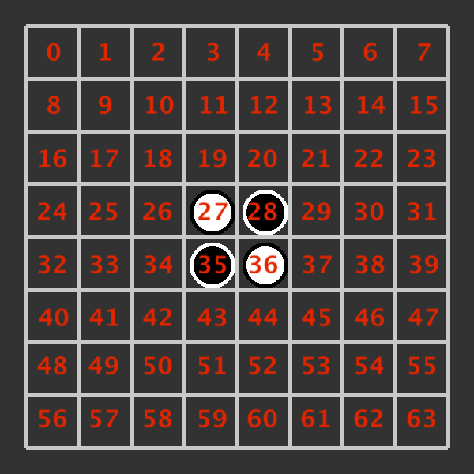
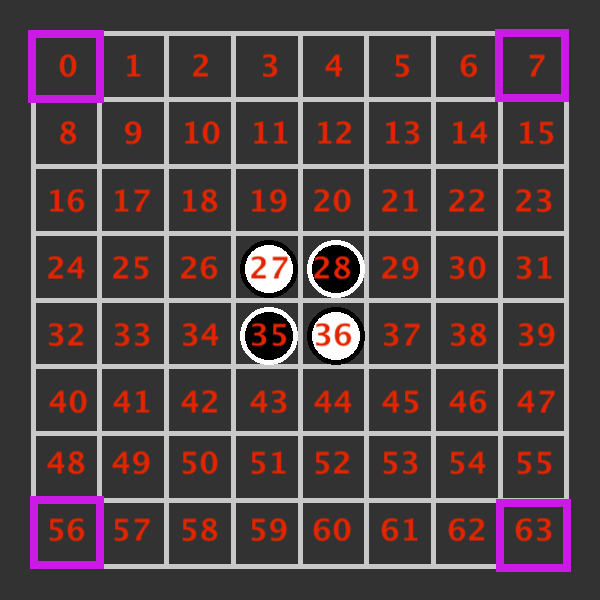
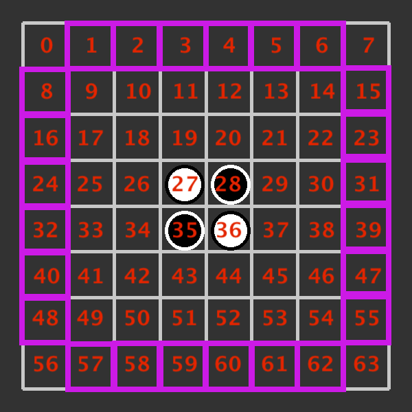
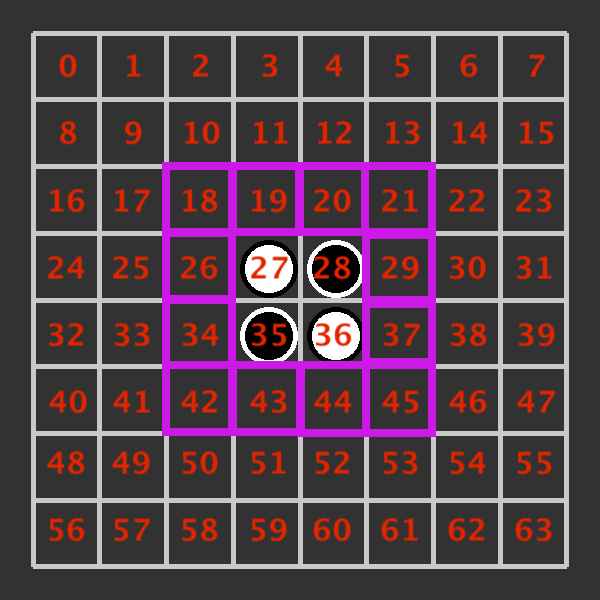
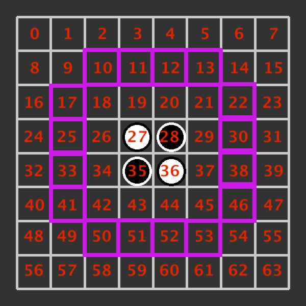
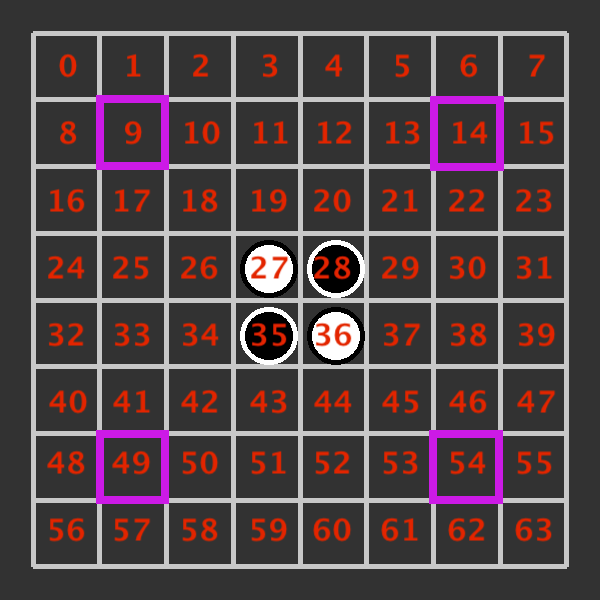

# **ECAM 2BA Projet Othello -195052 Oussama Sahib**
L'objectif est de créer une IA capable de participer à une compétition, dans laquelle plusieurs IA vont devoir s'affronter.
Tous les matchs de cette compétition se déroule avec les règles du célèbre jeu Othello.


## **Lancement du jeu**
Pour le lancement du jeu Othello, on utilise **l'interface graphique de Quentin Lurkin**: [Gestionnaire de partie-Othello](https://github.com/qlurkin/PI2CChampionshipRunner.git).
Puis, dans le terminal:
```
python -m pip install -r requirements.txt
python -m pip install pillow
python server.py othello
```
Ensuite, pour le lancement de l'IA, dans le  terminal:
```
python Inscription.py
```

On peut noter que s'il on veut changer le numéro de port du PC sur lequel on lance l'IA, il faut aller dans le fichier "IA.json" et changer le port   *(NB: Il faut mettre un numéro au-dessus de 1000)*:
```json
{
    "request": "subscribe",
    "port": numéro_de_port,
    "name": "Ouss-Ouss",
    "matricules": ["195052"]
 } 
```

## **Plateau du jeu**
Reversi est un jeu joué sur un plateau de 64  cases (8x8) entre 2 joueurs: "NOIR" et "BLANC"; où le joueur Noir se déplace en premier. Le plateau de départ est:




Le but du jeu est d'avoir plus de pions que l'adversaire à la fin de la partie. Au tour du joueur, il doit placer un pion de sa couleur sur le 
plateau. Si ce pion à placer et un autre de ses pions déjà présent se trouvent sur la même ligne, colonne ou diagonale, avec entre eux 2 un/des pion(s) de la couleur 
opposée, tous ces pions adverses prennent la couleur du joueur. On peut noter que le joueur ne peut faire un mouvement que s'il provoque l'inversion d'au moins 
une pièce; si aucun mouvement de ce type n'est disponible, le joueur est obligé de passer son tour. La partie est terminée lorsque le plateau est rempli ou qu'un des 
2 joueurs n'a plus du tout de pions.


## **Stratégie IA** ##
Au moment de son tour, parmi les mouvements possibles sur le plateau, mon IA va placer son pion en prenant en compte un système de priorité de cases à jouer.

### **1) Coins** ###
Dans le plateau, parmi les mouvements possibles, l'IA va jouer en 1ère priorité sur les coins. Il choisit les coins du plateau parce que ce sont tout simplement les meilleurs 
cases du jeu. En effet, les coins sont les seules cases où lorsqu'elles sont prises, elles ne peuvent plus être capturées par l'adversaire. En plus de cela,
les coins sont très stratégique pour piéger les pions adverses si ils se trouvent dans les diagonales du plateau.



### **2) Murs** ###
Dans le plateau, parmi les mouvements possibles, l'IA va jouer en 2ème priorité sur les murs. Les cases aux murs sont très stratégiques à prendre, parce que elles 
ont à subir moins d'angle d'attaque de l'adversaire. De plus, si on place un pion à côté d'un mur et qu'il est voisin en horizontale ou vertical d'un coins déjà pris
par l'IA, ce pion ne peut plus être capturé par l'adversaire.




### **3) Carrée central** ###
Dans le plateau, parmi les mouvements possibles, l'IA va jouer en 3ème priorité sur les murs. Ces cases sont les premières de la partie que l'IA va jouer, mais au
fur à mesure de la mesure, ce sont aussi celles qui ont tendance à le plus changer de couleur.



### **4) Avant dernier carrée** ###
Dans le plateau, parmi les mouvements possibles, l'IA va jouer en 4ème priorité sur quasi l'avant dernier carrée extérieur du plateau. Ces cases ne sont pas du tout
les plus stratégiques, car en y plaçant un pion, on donne l'opportunité à l'adversaire de prendre le mur au tour suivant. Ainsi, ces cases ne sont pas parmi les plus
importantes à prendre en priorité.



### **5) Cases de dernier recours**
Dans le plateau, parmi les mouvements possibles, l'IA va jouer en 5ème priorité sur la case en diagonale de chaque coin du plateau. Ces cases sont des cases de dernier
recours, et  à utilisee seulement si ce sont les seules cases disponibles. Celles-ci sont les pires du plateau, parce qu'elles donnent l'opportunité
à l'adversaire de prendre les coins du plateau qui sont les meilleurs positions.




## **Bibliothèques utilisées** ##
- socket
- json
- copy
- game (-->venant du gestionnaire du partie de Quentin Lurkin)
- pytest
